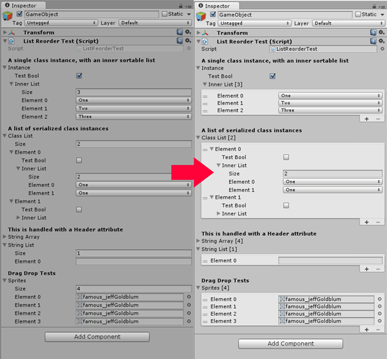
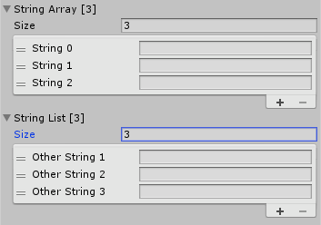
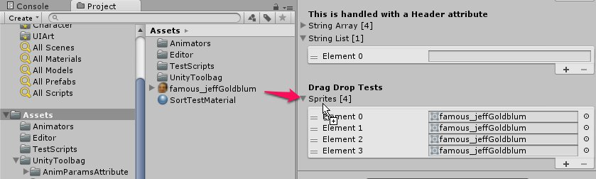
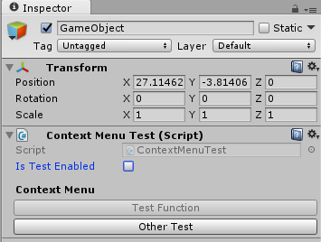

# Reorderable Inspector

Automatically turn arrays/lists into ReorderableLists in Unity inspectors. Inspired by [Alejandro Santiago's implementation](https://medium.com/developers-writing/how-about-having-nice-arrays-and-lists-in-unity3d-by-default-e4fba13d1b50).



# Usage

Place the folder in your project. By default, the inspector will only draw arrays marked with the `Reorderable` attribute

```C#
public class ListReorderTest : MonoBehaviour
{  
	[Reorderable]
	public string[] stringArray; // This will be drawn with a ReorderableList

	public List<string> stringList; // This will be drawn as a default array
}
```

If you want to apply the reorderable list to all arrays, edit `Editor\ReorderableArrayInspector.cs` and change `LIST_ALL_ARRAYS` to `true`

### Custom Element Names

You can set the name used for each element in the list by specifying it in the attribute. You can also set if the numbering will start from one or zero.

```C#
public class ListReorderTest : MonoBehaviour
{  
	[Reorderable("String")]
	public string[] stringArray; // Array elements listed as: "String 0"

	[Reorderable("Other String", isZeroIndex:false)]
	public List<string> stringList; // Array elements listed as: "Other String 1"
}
```



## Additional Features

Handles arrays/lists nested inside other classes

```C#
public class ListReorderTest : MonoBehaviour
{
	[Serializable]
	public class InternalClass
	{
		public bool testBool;
		[Reorderable] public List<int> innerList;
	}

	[Header("A single class instance, with an inner sortable list")]
	public InternalClass instance;

	[Reorderable]
	[Header("A list of serialized class instances")]
	public List<InternalClass> classList;
}
```

Drag and drop objects into arrays like the default inspector



Automatic `ContextMenu` buttons.

```C#
public class ContextMenuTest : MonoBehaviour
{
	public bool isTestEnabled;

	[ContextMenu("Test Function")]
	private void MyTestFunction()
	{
		Debug.Log("Test function fired");
	}

	[ContextMenu("Test Function", isValidateFunction:true)]
	private bool TestFunctionValidate()
	{
		return isTestEnabled;
	}

	[ContextMenu("Other Test")]
	private void NonValidatedTest()
	{
		Debug.Log("Non validated test fired");
	}
}
```



## Limitations

- Only supports Unity 5 and above
- ReorderableLists of class instances may be a little rough, especially below Unity version 5.3
- Custom inspectors will not automatically gain the ability to turn arrays into reorderable lists. See next section for creating custom inspectors that allow for this functionality.

# Custom inspectors

Custom inspectors will not automatically draw arrays as ReorderableLists unless they inherit from `ReorderableArrayInspector`.

The class contains helper functions that can handle default property drawing. Below is a template for a custom inspector.

```C#
[CustomEditor(typeof(YourCustomClass))]
public class CustomSortableInspector : ReorderableArrayInspector
{
	// Called by OnEnable
	protected override void InitInspector()
	{
		base.InitInspector();

		// Do your own initializations here
	}

	public override void OnInspectorGUI()
	{
		// Not initialized, try initializing
		if (listIndex == null)
			InitInspector();
		// No sortable arrays or list index unintialized
		if (hasSortableArrays == false || listIndex == null)
		{
			base.OnInspectorGUI();
			DrawContextMenuButtons();
			return;
		}

		serializedObject.Update();

		EditorGUI.BeginChangeCheck();

		// Call the relevant default drawer functions here
		/*
		// Draw all properties
		DrawDefaultSortable();

		// Like DrawPropertiesExcluding
		DrawSortableExcept("sprites");

		// Draw all properties, starting from specified property
		DrawPropertiesFrom("propertyName");

		// Draw all properties until before the specified property
		DrawPropertiesUpTo("endPropertyName");

		// Draw properties starting from startProperty, ends before endProperty
		DrawPropertiesFromUpTo("startProperty", "endProperty");
		*/

		// Write your custom inspector functions here
		EditorGUILayout.HelpBox("This is a custom inspector", MessageType.Info);

		if (EditorGUI.EndChangeCheck())
		{
			serializedObject.ApplyModifiedProperties();
			isInitialized = false;
			InitInspector();
		}

		DrawContextMenuButtons();
	}
}
```

You can get a reference to the `ReorderableList` drawing the property, allowing for further extension of the list.

```C#
// SerializableObject
public class YourCustomClass : SerializableObject
{
	[Reorderable]
	List<GameObject> enemyPrefabs;
}
```

```C#
// Custom inspector
[CustomEditor(typeof(YourCustomClass))]
public class CustomSortableInspector : ReorderableArrayInspector
{
	// Called by OnEnable
	protected override void InitInspector()
	{
		base.InitInspector();

		var propList = serializedObject.FindProperty("enemyPrefabs");
		ReorderableList listEnemies = GetSortableList(propList);
		// Modify the callbacks of the ReorderableList here. Refer here for details
		// http://va.lent.in/unity-make-your-lists-functional-with-reorderablelist/
	}
}
```
